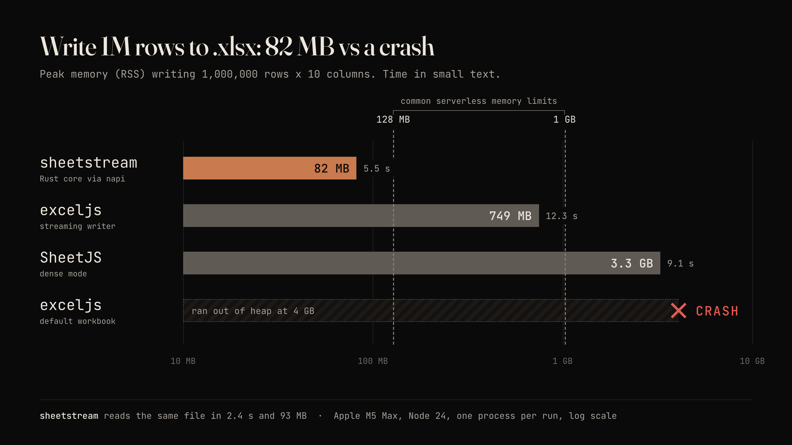
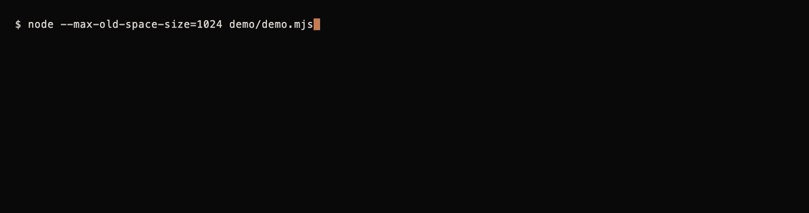

# sheetstream

Read and write XLSX and CSV files of any size from Node.js without ever holding all the rows in JavaScript.





v0.3. Prebuilt binaries for macOS (arm64, x64), Linux (x64 glibc, x64 musl, arm64 glibc) and Windows (x64) ship inside the package, so there is nothing to compile on install. Bun should work through its napi support but isn't tested yet. Not built yet: Linux arm64 with musl (Alpine on ARM).

New in 0.2: light formatting for XLSX (header style, column widths and number formats, frozen header, header filter) and streaming CSV read and write. See [Formatting](#formatting) and [CSV](#csv).

Native code (Rust, through napi-rs) does the parsing and zipping. Rows go in and out in batches of 1000 by default, so a million-row file costs tens of megabytes, not gigabytes.

## Install

```sh
npm install sheetstream
```

Prebuilt binaries ship for macOS (arm64, x64), Linux (x64 glibc, x64 musl, arm64 glibc) and Windows (x64). There is nothing to compile on install.

## Usage

```js
import { writeXlsx, readXlsx } from 'sheetstream'

function* rows() {
  for (let i = 0; i < 1_000_000; i++) yield { id: i, name: `user ${i}`, joined: new Date(), active: i % 2 === 0 }
}

await writeXlsx('users.xlsx', rows())            // resolves to { rows, bytes }

for await (const batch of readXlsx('users.xlsx')) {
  for (const user of batch) { /* user: { id, name, joined, active } */ }
}
```

More in [examples/](examples/): streaming an HTTP response, multiple sheets, a million-row round trip.

Copy-paste recipes for Express, Next.js, Hono, NestJS, Postgres cursors and large uploads are in [docs/recipes.md](docs/recipes.md).

## API

```ts
import { writeXlsx, readXlsx, XlsxWriter, listSheets, xlsxStream, toBuffer, writeCsv, csvStream, readCsv } from 'sheetstream'
```

### `writeXlsx(path, rows, options?)`

`rows` is any `Iterable` or `AsyncIterable` of arrays or plain objects. Rows are collected into batches and sent to Rust one batch at a time. Resolves to `{ rows, bytes }`. `rows` counts every row written, including the header.

| Option | Default | Meaning |
|---|---|---|
| `sheetName` | `'Sheet1'` | Name of the sheet. |
| `columns` | inferred | Key order for object rows, as strings or `{ key, header, width, numFmt }` objects. If omitted, the keys of the first object are used. See [Formatting](#formatting). |
| `header` | `true` for object rows, `false` for array rows | Write a header row. Array rows need `columns` to have one. |
| `headerStyle` | plain | `{ bold, fill, fontColor, border }` for the header row. |
| `freezeHeader` | `false` | Freeze the header row. |
| `autoFilter` | `false` | Add filter dropdowns to the header row. |
| `mode` | `'constant'` | `'constant'` writes inline strings and uses the least memory. `'lowMemory'` uses shared strings: smaller files, and memory grows with the number of distinct strings. |
| `batchSize` | `1000` | Rows per native call. |
| `signal` | none | An `AbortSignal` to stop a write in progress. |

A sync generator is fine as a source. The writer hands control back to the event loop every few milliseconds, so timers and requests keep running during a long write.

`xlsxStream`, `toBuffer` and `XlsxWriter.addSheet` take the same sheet options (`columns`, `header`, `headerStyle`, `freezeHeader`, `autoFilter`).

### `XlsxWriter`, multiple sheets

```js
const w = new XlsxWriter('out.xlsx', { mode: 'constant' })
const orders = w.addSheet('Orders', { columns: ['id', 'total'] })   // header, columns
orders.writeRows([{ id: 1, total: 9.5 }])                           // array of arrays or objects
await w.close()                                                     // { rows, bytes }
```

Each sheet must receive rows in order and uses either arrays or objects, not both. `w.abort()` discards everything without writing a file.

### `xlsxStream(rows, options?)` and `toBuffer(rows, options?)`

`xlsxStream` returns a Node `Readable` you can pipe into an HTTP response. An XLSX file is a zip, and a zip cannot be emitted before its central directory is known, so the workbook is written to a temp file first, then streamed from disk and deleted. `Readable.toWeb(stream)` gives a web `ReadableStream`.

`toBuffer` resolves to a `Buffer` of the whole file. Use it for small outputs only.

### `readXlsx(path, options?)`

Returns an async iterable of batches.

| Option | Default | Meaning |
|---|---|---|
| `sheet` | first sheet | Sheet name or zero-based index. |
| `batchSize` | `1000` | Rows per batch. |
| `header` | `true` | Use the first row as keys and yield objects. With `false`, batches are arrays of arrays. |

```js
for await (const batch of readXlsx('in.xlsx', { sheet: 'Orders', batchSize: 5000 })) { /* object[] */ }
const all = await readXlsx('small.xlsx').toArray()   // explicit opt-in, see below
```

Breaking out of the loop stops the native reader and closes the file. A parser thread runs a few batches ahead of your loop.

### `listSheets(path)`

Resolves to `[{ name, index }]`.

## Formatting

Real exports usually need a bold header, sensible widths and a currency or date format, and that is what 0.2 covers. It is deliberately basic: one header style, per-column width and number format, a frozen header row and a header filter. There are no per-cell or per-row styles, no conditional formats and no autofit.

```js
import { writeXlsx } from 'sheetstream'

await writeXlsx('invoices.xlsx', invoices(), {
  columns: [
    { key: 'id', header: 'Invoice', width: 10 },
    { key: 'customer', header: 'Customer', width: 28 },
    { key: 'total', header: 'Total (USD)', width: 14, numFmt: '#,##0.00' },
    { key: 'margin', header: 'Margin', numFmt: '0%' },
    { key: 'issued', header: 'Issued', width: 12, numFmt: 'yyyy-mm-dd' },
    'status',                                   // a plain string still works
  ],
  headerStyle: { bold: true, fill: '#1F4E79', fontColor: '#FFFFFF', border: true },
  freezeHeader: true,
  autoFilter: true,
})
```

What each option does:

- `headerStyle` applies to every cell of the header row. Colors are hex (`'#1F4E79'`, `'1F4E79'` or `'#fff'`). Leave it out and the header is plain.
- `columns[].width` is in Excel character units, the number you see in Excel's column width box. Allowed range is above 0 up to 255. Unset columns keep Excel's default. There is no autofit, because choosing a width from the data would need every row in memory.
- `columns[].numFmt` is any Excel number format string. It applies to the column's numbers and Dates, so `numFmt: 'dd/mm/yyyy'` replaces the default `yyyy-mm-dd` for that column. The header row keeps its own style and is not number-formatted.
- `freezeHeader` freezes the first row. `autoFilter` puts filter dropdowns on the header and covers the whole data range. Both need a header row: with `header: false`, or array rows without `columns`, they do nothing.
- For array rows, `columns` objects apply by position and `key` is only a label.

All of it works in `'constant'` and `'lowMemory'` modes and costs no extra memory. Widths and formats are stored once per column, and every data cell in a formatted column carries a style index, a few bytes of XML per cell. The measured 1M row by 10 column write with a width and number format on every column plus a styled, frozen, filtered header peaks at about 80 MB of RSS, the same as without formatting. How it works under the hood: rust_xlsxwriter in constant-memory mode flushes rows as it goes, but it writes the sheet settings (column widths and formats, the frozen pane) before the first row, and an unformatted cell picks up its column's format when it is saved. The header is the only row written with a format of its own. The filter range is added when the file is closed, once the last row is known.

## CSV

```js
import { writeCsv, csvStream, readCsv } from 'sheetstream'

await writeCsv('users.csv', rows(), { delimiter: ';', bom: true })

for await (const batch of readCsv('users.csv', { delimiter: ';', inferTypes: true })) {
  for (const user of batch) { /* user: { id, name, joined, active } */ }
}
```

Both stream through the Rust `csv` crate in constant memory: 1M rows by 10 columns writes in about 1 second at roughly 80 MB of RSS, including the benchmark's row generator, and reads back at similar memory.

`writeCsv(path, rows, options?)` takes the same row shapes as `writeXlsx` (arrays or objects, sync or async iterables) and the same `columns` and `header` rules, including `{ key, header }` columns. `width`, `numFmt` and the XLSX-only formatting options are ignored.

| Option | Default | Meaning |
|---|---|---|
| `columns`, `header` | as `writeXlsx` | Keys, order and header text. |
| `delimiter` | `','` | One ASCII character. |
| `quote` | `'"'` | One ASCII character. Fields containing it, the delimiter or a line break are quoted, and the quote is doubled inside. |
| `bom` | `false` | Start with a UTF-8 byte order mark so Excel reads non-ASCII text correctly. |
| `batchSize` | `1000` | Rows per native call. |
| `signal` | none | An `AbortSignal`. A failed or aborted write deletes the partial file. |

### `csvStream(rows, options?)`

A Node `Readable` of CSV bytes, for piping into an HTTP response or any other writable. Unlike `xlsxStream` nothing goes through a temp file: CSV has no central directory, so bytes leave as rows are consumed.

```js
import http from 'node:http'
import { pipeline } from 'node:stream/promises'
import { csvStream } from 'sheetstream'

http.createServer(async (req, res) => {
  res.setHeader('content-type', 'text/csv; charset=utf-8')
  res.setHeader('content-disposition', 'attachment; filename="users.csv"')
  try {
    await pipeline(csvStream(db.users.cursor(), { bom: true }), res)
  } catch {
    // the client went away, or the source threw: both streams are already destroyed
  }
}).listen(3000)
```

It takes the same options as `writeCsv` and produces the same bytes for the same rows, encoded by the same Rust `csv` writer. `rows` can be an array, a sync or async iterable, or a Node `Readable` in object mode. One extra option, `highWaterMark` (default `65536`), is how many bytes the stream buffers before it stops pulling rows.

Backpressure is real. The stream asks the source for rows only while its buffer has room, encodes them a batch at a time, and stops the moment `push()` reports the buffer is full. When the consumer is slow, for example a client on a bad connection, `res.write()` backs up, the readable stops reading, and the source stops running. At most `highWaterMark` bytes plus one batch are ever held, so a million rows stream in flat memory. In the test suite, a source that could yield 1M rows stays under 8,100 rows ahead of a deliberately slow writable, and 1M rows by 10 columns peaks under the same 150 MB RSS limit as `writeCsv`.

Stopping early is clean:

- `stream.destroy()`, or the client disconnecting under `pipeline`, calls `return()` on the source's iterator, so a generator's `finally` block runs and a database cursor can close.
- An error thrown by the source destroys the stream with that error.
- `signal` aborts the stream with `signal.reason` and also closes the source, even if it is stuck waiting on something.
- The source is not touched until the first read.

For web-style handlers (Hono, Next.js route handlers, Workers-style runtimes on Node), convert it with `Readable.toWeb`:

```js
import { Readable } from 'node:stream'

export function GET() {
  return new Response(Readable.toWeb(csvStream(rows())), {
    headers: { 'content-type': 'text/csv; charset=utf-8' },
  })
}
```

`readCsv(path, options?)` returns an async iterable of batches, like `readXlsx`, with `.toArray()` for small files.

| Option | Default | Meaning |
|---|---|---|
| `header` | `true` | Use the first row as keys and yield objects (duplicate or empty names become `name_2`, `column3`). With `false`, batches are arrays of arrays. |
| `delimiter`, `quote` | `','`, `'"'` | One ASCII character each. |
| `batchSize` | `1000` | Rows per batch. |
| `inferTypes` | `false` | Turn plain numbers, `true` and `false` (any case) and ISO dates into numbers, booleans and Dates. |

CSV has no types, so by default every non-empty field comes back as a string and empty fields as `null`. With `inferTypes`, a field becomes a number only if it is a plain decimal with at most 15 digits and no leading zeros (so `007`, zip codes and long ids stay strings), and a Date only if it is `YYYY-MM-DD` or `YYYY-MM-DDTHH:MM:SS[.fff]Z`. Writing uses the same text forms: Dates as ISO 8601 in UTC (midnight UTC as a plain date), booleans as `true` and `false`, `null` and `undefined` as empty fields, NaN and Infinity as text. A BOM is always stripped on read, line endings can be `\n` or `\r\n`, invalid UTF-8 is replaced rather than rejected, and blank lines are skipped. Rows longer than the first row keep their extra fields, shorter ones are padded with `null`.

## Memory versus convenience

Streaming is the default and the only thing the library does on its own. `toArray()` exists because sometimes you want the whole sheet, but it holds every row in V8 memory. Measured here, `toArray()` on the million-row benchmark file peaked at about 590 MB of RSS with `header: false`, and object rows cost more. Sheets much larger than that will hit Node's heap limit. Prefer the async iterator and process each batch as it arrives.

Memory you should still expect:

- CSV reading and writing hold one batch and a 64 KB buffer. `csvStream` holds one batch plus up to `highWaterMark` bytes of output.
- Writing in `'constant'` mode holds one batch plus a small zip buffer. The sheet XML goes to a temp file (about 5 times the final file size, 525 MB for the million-row benchmark file) before it is compressed into the output, so the temp directory needs the disk space.
- Writing in `'lowMemory'` mode also keeps the table of distinct strings in RAM. It is cheap for repeated values and costly for a million unique strings.
- Reading holds the file's shared strings table in RAM (the whole table, not just the strings in the current batch). Files written in `'constant'` mode have none.
- `xlsxStream` and `toBuffer` write to a temp file, so disk, not RAM, is the cost.

## Cell mapping

Write:

| JS value | Cell |
|---|---|
| number | number (NaN and Infinity are written as text, Excel cannot store them) |
| string | string (inline in `'constant'` mode), up to 32,767 characters |
| boolean | boolean |
| Date | Excel date or datetime with a date format. Dates before 1900-01-01 cannot be stored by Excel and are written as ISO text. An invalid Date is an empty cell. |
| null, undefined | empty cell |
| bigint | number if it is within the safe integer range, otherwise a string |
| anything else | throws, with the row and column |

Read:

| Cell | JS value |
|---|---|
| number, string, boolean | as is |
| date or datetime format | `Date` (UTC) |
| duration format | number of days |
| error (`#DIV/0!` and so on), empty | `null` |
| formula | its cached value |

Reading details: leading blank rows are skipped, interior blank rows are kept as rows of `null`, and column A is always index 0. Rows are padded with `null` to the width the sheet declares, so trailing empty cells in a row survive only if the sheet's used range reaches them. Duplicate or empty header cells become `name_2`, `column3` and so on.

## Support matrix

| | v0.2 |
|---|---|
| Cell data: numbers, strings, booleans, dates, empty | yes |
| Several sheets, choose by name or index | yes |
| Streaming read and write, any iterable or async iterable | yes |
| Object rows with column inference | yes |
| Header style (bold, fill, font color, border) | supported, basic |
| Column widths | supported, basic |
| Number formats per column | supported, basic |
| Freeze header row | supported, basic |
| Filter on the header row | supported, basic |
| CSV read and write, streaming | yes |
| CSV as a Node `Readable` with backpressure (`csvStream`) | yes |
| Per-cell or per-row styles, fonts beyond the header, conditional formats, autofit | not yet |
| Formulas (writing them) | not yet |
| Merged cells, freeze panes other than the first row | not yet |
| Images and charts | not yet |
| Reading `.xls`, `.xlsb`, `.ods`, password-protected files | not yet |
| Node.js 18+ | yes |
| Bun | expected to work through N-API, not yet tested in CI |

Excel's own limits apply: 1,048,576 rows and 16,384 columns per sheet.

## Benchmark

1,000,000 rows by 10 columns (int, float, six short strings, date, bool). Apple M5 Max, Node 24.20, each case run once in its own process under `nice` with `--max-old-space-size=4096` and a 90 second cap. Peak RSS comes from `/usr/bin/time -l` and includes the benchmark's row generator, about 65 MB.

Write:

| Library | Time (s) | Peak RSS (MB) | File (MB) |
|---|---:|---:|---:|
| sheetstream (constant) | 5.5 | 82 | 110.9 |
| sheetstream (lowMemory) | 5.4 | 101 | 68.6 |
| exceljs default | crash (heap out of memory) | - | - |
| exceljs streaming | 12.3 | 749 | 78.1 |
| SheetJS dense | 9.1 | 3270 | 214.9 |

Read (input written by sheetstream):

| Library | Time (s) | Peak RSS (MB) |
|---|---:|---:|
| sheetstream | 2.4 | 93 |
| exceljs streaming | 9.1 | 376 |
| SheetJS dense | 16.3 | 3048 |

The honest summary: memory is a very large win, reading is about 4 times faster than exceljs streaming, and writing is about 2 times faster than the best JS option. Reproduce with `npm run bench` (full numbers in [bench/RESULTS.md](bench/RESULTS.md)).

## Building from source

```sh
npm install
npm run build        # needs a Rust toolchain
npm test
```

## License

MIT
